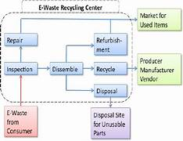
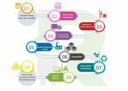
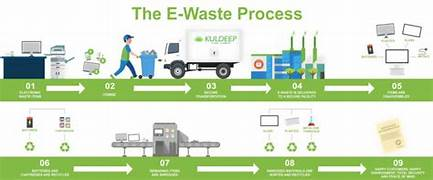

# Smart India Hackathon Workshop
# Date:13-05-2024
## Register Number:212223040063
## Name:HARISHA S
## Problem Title
E-Waste Facility Locator
## Problem Description
Website that tells you the location of the nearest e-waste collection and recycling facility. Offers educational pop-ups on the harmful components of your e-waste and their effects on the environment and human health if not disposed correctly. There could be an option to input the model of your old device and earn credit points relative to the amount of precious metals recovered from the device if disposed correctly.
## Problem Creater's Organization
Ministry of Environment

## Idea

1.Creating an E-Waste Facility Locator is a great initiative to encourage responsible disposal of electronic waste and promote recycling. Here are some ideas to consider when developing such a platform:

2.User-Friendly Interface: Design a simple and intuitive interface that allows users to easily search for nearby e-waste recycling facilities. Consider incorporating features such as maps, search filters (by location, type of e-waste accepted, etc.), and clear instructions for drop-off procedures.

3.Comprehensive Database: Compile a comprehensive database of e-waste recycling facilities, including both official recycling centers and other collection points such as retailers or community drop-off locations. Ensure that the database is regularly updated to reflect any changes in facility locations, hours of operation, or accepted materials.

4.Mobile Compatibility: Make the platform accessible via mobile devices, as many users may prefer to search for recycling facilities while on the go. Consider developing a mobile app for added convenience.

5.Educational Resources: Provide educational resources on the platform to raise awareness about the importance of e-waste recycling and the environmental impacts of improper disposal. This could include articles, infographics, or videos explaining the recycling process and the benefits of recycling e-waste.

6.Integration with Social Media: Allow users to share their recycling activities on social media platforms directly from the locator tool. This could help spread awareness and encourage others to recycle their e-waste responsibly.

7.Feedback and Ratings: Implement a system for users to provide feedback and ratings on their experiences with different recycling facilities. This can help other users make informed decisions and incentivize facilities to maintain high standards of service.

8.Partnerships: Collaborate with local governments, environmental organizations, and businesses to promote the platform and encourage participation in e-waste recycling initiatives. Partnerships can help increase visibility and reach a wider audience.

9.Promotional Campaigns: Launch promotional campaigns to encourage users to use the locator tool and recycle their e-waste responsibly. This could include incentives such as discounts or rewards for recycling certain types of electronics.

10.Accessibility Features: Ensure that the platform is accessible to all users, including those with disabilities. This may involve implementing features such as text-to-speech functionality or compatibility with screen readers.

11.Data Security and Privacy: Prioritize data security and privacy to protect users' personal information. Implement measures such as encryption, secure data storage, and clear privacy policies to reassure users that their information is safe.

12.By incorporating these ideas into your E-Waste Facility Locator, you can create a valuable resource that helps individuals and businesses dispose of their electronic waste responsibly while raising awareness about the importance of recycling.

## Proposed Solution / Architecture Diagram

## Use Cases

User Interface (UI):

1.Web Interface: Allows users to interact with the platform through a web browser.
Mobile App Interface: Provides a mobile-friendly interface for users to access the platform on smartphones and tablets.
Application Layer:

2.Search Engine: Implements the search functionality to enable users to find nearby e-waste recycling facilities based on various criteria such as location, accepted materials, and operating hours.
User Authentication: Manages user authentication and authorization processes to ensure secure access to the platform's features.
Content Management System (CMS): Handles the publication and management of educational resources, news updates, and promotional content.
Feedback and Rating System: Collects user feedback and ratings on recycling facilities to help other users make informed decisions.
Data Layer:

3.E-Waste Facility Database: Stores information about e-waste recycling facilities, including their locations, contact details, accepted materials, operating hours, and user ratings.
User Profiles Database: Stores user account information, preferences, and feedback.
Content Database: Stores educational resources, news articles, and promotional content.
Integration Layer:

4.Maps and Geolocation Services: Integrates with mapping services (e.g., Google Maps, OpenStreetMap) and geolocation APIs to provide location-based search functionality and display facility locations on maps.
Social Media Integration: Integrates with social media platforms to allow users to share their recycling activities and promote the platform.
External APIs: Interfaces with external APIs to access additional data sources or services, such as environmental databases, government resources, or partner organizations.
Security Layer:

5.Authentication and Authorization: Ensures secure access to the platform's features and data through user authentication mechanisms (e.g., OAuth, JWT) and role-based access controls.
Data Encryption: Encrypts sensitive data at rest and in transit to protect against unauthorized access.
Security Monitoring and Incident Response: Implements logging, monitoring, and alerting mechanisms to detect and respond to security threats or suspicious activities.
Use Cases:

6.Users can search for e-waste recycling facilities based on their current location or specified address.
Users can filter search results based on criteria such as accepted materials, operating hours, or user ratings.
View Facility Details:

7.Users can view detailed information about individual recycling facilities, including their addresses, contact details, accepted materials, operating hours, and user ratings.
Users can access directions to the selected facility using integrated mapping services.
Provide Feedback and Ratings:

8.Users can provide feedback and ratings on their experiences with recycling facilities, helping other users make informed decisions.
Users can submit comments or suggestions for improving recycling facilities or the platform itself.
Access Educational Resources:

9.Users can access educational resources, articles, and videos about the importance of e-waste recycling, environmental impacts, and recycling best practices.
Users can share educational content on social media to raise awareness and promote responsible recycling habits.
User Authentication and Account Management:

10.Users can create accounts, log in, and manage their profiles to personalize their experience on the platform.
Users can update their preferences, view their recycling history, or manage their feedback submissions.
This proposed solution architecture and use cases outline the key components and functionalities of an E-Waste Facility Locator platform, aimed at facilitating responsible e-waste disposal and promoting environmental sustainability.

## Technology Stack

Frontend Development:

1.Framework: React.js or Vue.js for building responsive and interactive user interfaces.
UI Components: Material-UI or Bootstrap for designing consistent and visually appealing UI components.
Mapping Integration: Leaflet.js or Google Maps API for integrating maps and geolocation services.
Backend Development:

2.Programming Language: Node.js with Express.js for building the backend server.
Database: MongoDB or PostgreSQL for storing data such as e-waste facility details, user information, and feedback.
RESTful API: Design a RESTful API to handle client-server communication for various functionalities like search, user authentication, and data retrieval.
Authentication and Authorization:

3.Authentication: JSON Web Tokens (JWT) for implementing user authentication and session management.
Authorization: Role-based access control (RBAC) for defining user permissions and access levels.
Data Storage and Management:

4.Cloud Storage: Amazon S3 or Google Cloud Storage for storing static assets like images, videos, and educational resources.content Management System (CMS): Strapi or KeystoneJS for managing dynamic content such as news articles, educational resources, and promotional content.
Geolocation Services:

5.Mapping Services: Google Maps API or OpenStreetMap for integrating maps and geolocation features.
Geocoding: Mapbox Geocoding API or Google Maps Geocoding API for converting addresses into geographic coordinates.
Security:

6.Encryption: HTTPS protocol for secure communication between clients and servers.
Data Encryption: Use libraries like bcrypt.js for encrypting sensitive user data and passwords.
Security Headers: Implement security headers to mitigate common web security vulnerabilities like XSS and CSRF attacks.
Monitoring and Logging:

7.Logging: Winston or Morgan for logging server-side activities and errors.
Monitoring: Implement tools like New Relic or Prometheus for monitoring server performance, uptime, and resource usage.
Deployment and Scalability:

8.Hosting Platform: AWS (Amazon Web Services) or Google Cloud Platform for deploying and hosting the application.
Containerization: Docker for containerizing application components and Kubernetes for orchestrating containers in a scalable and resilient manner.
Testing and Quality Assurance:

9.Unit Testing: Jest or Mocha for writing and running unit tests for backend components.
Integration Testing: Supertest for testing HTTP endpoints and API integration.
UI Testing: Cypress or Selenium for writing end-to-end tests to ensure UI functionality and user experience.
Version Control and Collaboration:

10.Version Control: Git for version control and managing codebase changes.
Collaboration Tools: GitHub or GitLab for hosting repositories, managing issues, and facilitating collaboration among development teams.
This technology stack provides a robust foundation for building an E-Waste Facility Locator platform with features such as search functionality, user authentication, data management, and integration with mapping services. Depending on specific requirements and preferences, you can customize and adjust the stack accordingly.

## Dependencies
Mapping Services – 15 Days,Data Collection – 18 Days,Estimated Budget – Rs.40,0000
